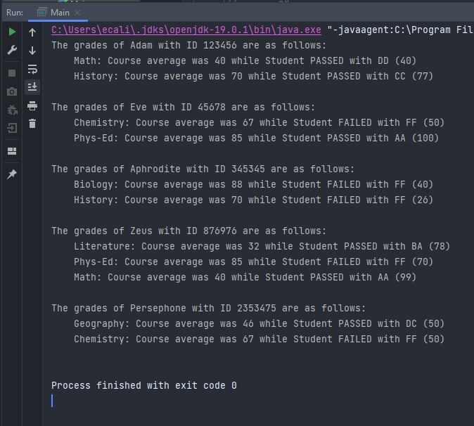

# School

Java Grade Report generator focusing on Object Oriented Programming.
The user has ability of creating Student objects and Course objects. 
Every Course object can have a name and an average assigned to it, whilst the Student object can have Name, ID, and Course Object.

